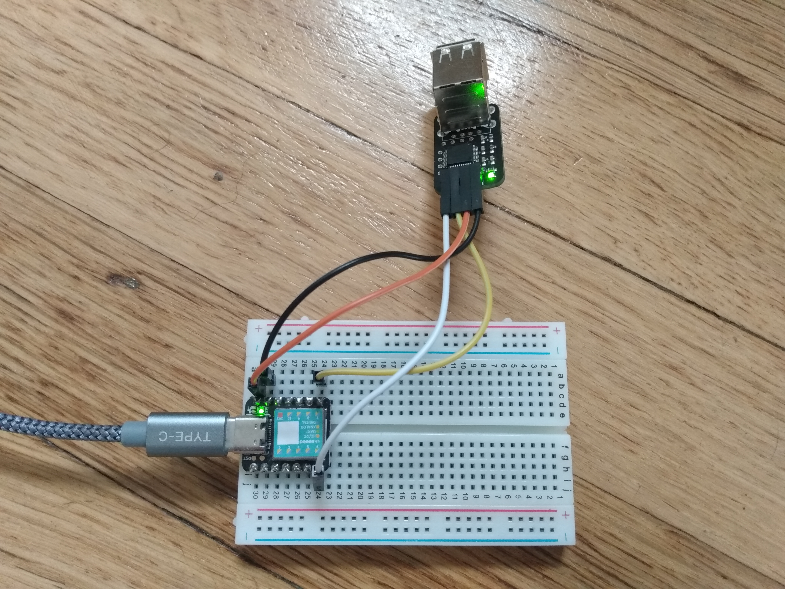

# CH559 (USB to Serial) CircuitPython Library

## Why?

Because you might want to get keyboard/mouse/gamepad/HID input into your CircuitPython projects without having to think much about USB.

## Usage
1. Copy the `adafruit_hid` CircuitPython library bundle into the `lib` directory on your CircuitPython device.
2. Copy the [ch559.py](ch559.py) file into the `lib` directory on your CircuitPython device.
3. Hook up the CH559's Tx and Rx pins to your desired UART pins on the CircuitPython device. (In the example image below, I am using pins D6 (TX) and D7 (RX) on a [Seeeduino XIAO](https://www.seeedstudio.com/Seeeduino-XIAO-Arduino-Microcontroller-SAMD21-Cortex-M0+-p-4426.html)). Also, make sure your CH995 is powered - this will depend on the breakout board you're using.
4. See [code.py](code.py) for usage. tl;dr:
   1. Create a UART instance.
   2. Create an instance of `Ch559`, passing the UART in as a dependency.
   3. repeatedly call `ch559.poll()` to get the latest events.

  
Example connection using a Seeeduino XIAO and a CH559 breakout from [MatzElectronics on Tindie](https://www.tindie.com/products/matzelectronics/ch559-usb-host-to-uart-bridge-module/).
  

